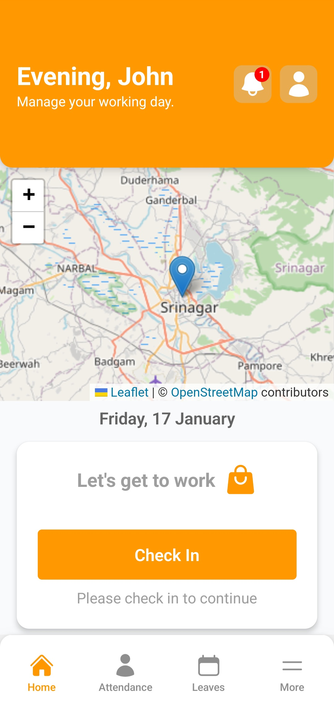
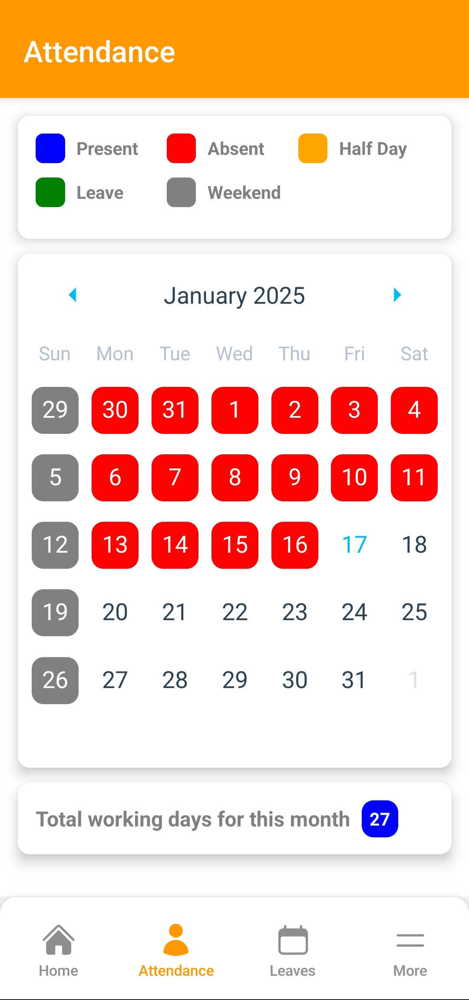
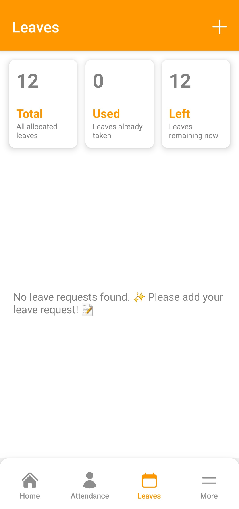

# EmployeeManagementSystem

A full-stack mobile application for field workforce management, built for **Abraq Nurseries**. The system enables real-time employee tracking, digital attendance management, leave administration, expense reporting with geo-tagged photo evidence, and sales lead logging — all accessible via a cross-platform mobile app backed by a Node.js REST API.

---

## Screenshots

<p align="center">
  
  &nbsp;&nbsp;
  
  &nbsp;&nbsp;
  
</p>

<p align="center">
  <b>Home Dashboard</b> &nbsp;&nbsp;&nbsp;&nbsp;&nbsp;&nbsp;&nbsp;&nbsp;&nbsp;&nbsp;&nbsp;&nbsp;&nbsp;&nbsp;&nbsp;&nbsp;&nbsp;&nbsp;&nbsp;&nbsp;
  <b>Attendance Calendar</b> &nbsp;&nbsp;&nbsp;&nbsp;&nbsp;&nbsp;&nbsp;&nbsp;&nbsp;&nbsp;&nbsp;&nbsp;&nbsp;&nbsp;&nbsp;&nbsp;&nbsp;&nbsp;&nbsp;&nbsp;
  <b>Leave Management</b>
</p>

| Screen | What you see |
|---|---|
| **Home Dashboard** | Personalized greeting, live GPS map pin showing current location, prominent Check In CTA, and bottom navigation |
| **Attendance Calendar** | Monthly calendar with color-coded days — Present (blue), Absent (red), Half Day (orange), Leave (green), Weekend (grey) — plus total working days count |
| **Leave Management** | At-a-glance balance cards showing Total / Used / Remaining annual leaves, and a list of all submitted leave requests |

---

## Table of Contents

- [Overview](#overview)
- [Tech Stack](#tech-stack)
- [Features](#features)
- [Architecture](#architecture)
- [API Reference](#api-reference)
- [Database Schema](#database-schema)
- [Real-time Features](#real-time-features)
- [Getting Started](#getting-started)
- [Project Structure](#project-structure)
- [Screenshots & Modules](#screenshots--modules)

---

## Overview

Anllp EMS solves a core operational challenge for businesses with distributed field teams: **how do you manage, verify, and coordinate a workforce that is never in one place?**

The application provides:
- GPS-verified check-in/check-out with automatic background location logging every 30 minutes
- A live admin dashboard showing the real-time position of all active employees on a map
- A full leave request and approval workflow with automatic balance tracking
- Digitally stamped expense photos (GPS coordinates + company watermark) submitted for admin review
- Sales lead capture with precise geolocation for each prospect

---

## Tech Stack

### Frontend — React Native (Mobile)

| Category | Technology |
|---|---|
| Framework | React Native 0.76.5 (TypeScript) |
| UI Library | React Native Paper 5.12.5 |
| Navigation | React Navigation — Bottom Tabs, Native Stack |
| State Management | Context API (Auth Context) |
| HTTP Client | Axios 1.7.9 |
| Maps | React Native Maps 1.20.1 |
| Calendar | React Native Calendars 1.1307.0 |
| Push Notifications | Firebase Cloud Messaging (FCM) + Notifee |
| Background Services | React Native Background Actions |
| Location | React Native Geolocation + Get Location |
| Image Handling | React Native Image Picker, Image Resizer, Blob Util |
| PDF Viewer | React Native PDF |
| Local Storage | AsyncStorage |
| Icons | React Native Heroicons 4.0.0 |

### Backend — Node.js REST API

| Category | Technology |
|---|---|
| Runtime | Node.js ≥ 18 |
| Framework | Express.js 4.21.1 |
| Database | Microsoft SQL Server (raw queries + Sequelize) |
| Authentication | JSON Web Tokens (jsonwebtoken 9.0.2) |
| Real-time | Socket.IO 4.8.1 |
| File Uploads | Multer 1.4.5 |
| Image Processing | Jimp 0.20.2 + Sharp 0.33.5 |
| Date Handling | Moment.js 2.30.1 |
| Dev Server | Nodemon 3.1.7 |

---

## Features

### Employee Portal

| Feature | Description |
|---|---|
| **Geo-Verified Attendance** | Check in/out with GPS coordinates; background service logs location every 30 minutes during active shifts |
| **Attendance History** | Color-coded calendar view showing present, absent, and on-leave days |
| **Leave Management** | Apply for Sick or Casual Leave with date range selection; view annual leave balance in real time |
| **Expense Reporting** | Submit daily expenses across categories (Food, Travel, Entertainment, Utilities) with a photo that is automatically watermarked with GPS coordinates and the company name |
| **Sales Lead Entry** | Log new grower prospects with contact details, farm area (kanal/marla), and precise GPS pin |
| **Profile & Security** | View profile, update personal information, and change password |
| **Push Notifications** | Receive real-time alerts for leave approvals/rejections and expense status updates via FCM |

### Admin Portal

| Feature | Description |
|---|---|
| **Attendance Dashboard** | View daily attendance across the entire workforce; filter by date and status |
| **Live Location Map** | Real-time map displaying the current GPS position of every active employee via Socket.IO |
| **Leave Approvals** | Approve or reject leave requests; system automatically adjusts employee leave balance on approval |
| **Expense Review** | Inspect submitted expenses with geo-tagged photo evidence; approve or reject with reason |
| **Sales Lead Oversight** | Review all leads submitted by field employees with full grower details |

---

## Architecture

```
┌─────────────────────────────────────────────────────────┐
│                  React Native App (iOS / Android)         │
│  ┌────────────┐  ┌──────────────┐  ┌─────────────────┐  │
│  │ Auth Layer │  │  Navigation  │  │  Context Store  │  │
│  └────────────┘  └──────────────┘  └─────────────────┘  │
│         │                │                  │             │
│         └────────────────┴──────────────────┘            │
│                          │ Axios (REST)                   │
│                          │ Socket.IO (WebSocket)          │
└──────────────────────────┼──────────────────────────────-┘
                           │
┌──────────────────────────▼──────────────────────────────┐
│               Express.js API Server (Port 8090)          │
│  ┌──────────────────────────────────────────────────┐   │
│  │  Auth Middleware (JWT validation)                │   │
│  └──────────────────────────────────────────────────┘   │
│  ┌───────────┐ ┌──────────┐ ┌──────────┐ ┌──────────┐  │
│  │   Auth    │ │Attendance│ │  Leave   │ │ Expense  │  │
│  │ Routes   │ │ Routes  │ │ Routes  │ │ Routes  │  │
│  └───────────┘ └──────────┘ └──────────┘ └──────────┘  │
│  ┌──────────────┐  ┌───────────────────────────────┐    │
│  │  Sales Lead  │  │  Socket.IO (Live Locations)  │    │
│  │   Routes    │  │  /appUsers   /admins          │    │
│  └──────────────┘  └───────────────────────────────┘    │
│                          │                               │
│  ┌───────────────────────▼───────────────────────────┐  │
│  │         Microsoft SQL Server Database              │  │
│  └────────────────────────────────────────────────────┘  │
└──────────────────────────────────────────────────────────┘
         │
┌────────▼────────────┐    ┌─────────────────────────┐
│  Firebase Cloud     │    │  Local File System       │
│  Messaging (FCM)    │    │  /images  /growerLayouts │
└─────────────────────┘    └─────────────────────────┘
```

---

## API Reference

### Authentication

| Method | Endpoint | Auth | Description |
|---|---|---|---|
| `POST` | `/api/auth/login` | ✗ | Authenticate with employee ID and password; returns JWT |
| `PATCH` | `/api/auth/changepassword` | ✓ | Update authenticated user's password |

### Attendance

| Method | Endpoint | Auth | Description |
|---|---|---|---|
| `POST` | `/api/attendance/checkin` | ✓ | Record check-in with timestamp |
| `PATCH` | `/api/attendance/checkout` | ✓ | Record check-out and compute session duration |
| `POST` | `/api/attendance/locationlog` | ✓ | Log background GPS coordinate (called every 30 min) |
| `GET` | `/api/attendance/status/:userId?` | ✓ | Get attendance records (filterable by date and status) |
| `GET` | `/api/attendance/logs/:attendanceId?` | ✓ | Get all location log entries for a session |
| `GET` | `/api/attendance/user` | ✓ | Get calling user's complete attendance history |

### Leave Management

| Method | Endpoint | Auth | Description |
|---|---|---|---|
| `POST` | `/api/leaves/add` | ✓ | Submit a new leave application |
| `GET` | `/api/leaves/get/:userId?` | ✓ | Fetch leave requests and current balance |
| `PATCH` | `/api/leaves/update/:action/:leaveId` | ✓ | Approve or reject a leave request (admin) |

### Daily Expenses

| Method | Endpoint | Auth | Description |
|---|---|---|---|
| `POST` | `/api/dailyexpenses/add` | ✓ | Submit expense with geo-tagged photo (`multipart/form-data`) |
| `GET` | `/api/dailyexpenses/:userId?` | ✓ | Retrieve expense submissions |
| `PATCH` | `/api/dailyexpenses/update` | ✓ | Approve or reject an expense (admin) |

### Sales Leads

| Method | Endpoint | Auth | Description |
|---|---|---|---|
| `POST` | `/api/saleslead/add` | ✓ | Create a new sales lead with GPS pin |
| `PUT` | `/api/saleslead/update/:wid` | ✓ | Update an existing lead |
| `GET` | `/api/saleslead/get` | ✓ | List all leads (paginated) |


> All protected endpoints require `Authorization: Bearer <token>` header.

---

## Database Schema

### Core Tables

**`appUsers`** — System users (employees and admins)
```sql
userId        INT           PRIMARY KEY IDENTITY
userName      NVARCHAR(100)
email         NVARCHAR(100) UNIQUE
passwordHash  NVARCHAR(255)
role          NVARCHAR(50)  DEFAULT 'Employee'
createdAt     DATETIME      DEFAULT GETDATE()
```

**`Attendance`** — Daily shift records
```sql
attendanceId      INT       PRIMARY KEY IDENTITY
userId            INT       FOREIGN KEY → appUsers
checkInTime       DATETIME
checkOutTime      DATETIME
status            NVARCHAR  COMPUTED ('Active' | 'Not Active' | 'On Leave')
sessionDuration   INT       COMPUTED (minutes)
attendanceDate    DATE
onLeave           BIT       DEFAULT 0
createdAt         DATETIME  DEFAULT GETDATE()
```

**`locationLogs`** — Periodic GPS snapshots
```sql
locationId    INT     PRIMARY KEY IDENTITY
attendanceId  INT     FOREIGN KEY → Attendance
latitude      FLOAT
longitude     FLOAT
loggedAt      DATETIME DEFAULT GETDATE()
```

**`LeaveRequests`** — Leave applications and workflow state
```sql
LeaveId       INT           PRIMARY KEY IDENTITY
UserId        INT           FOREIGN KEY → appUsers
LeaveType     NVARCHAR(50)  -- 'Sick Leave' | 'Casual Leave'
StartDate     DATE
EndDate       DATE
Status        NVARCHAR(20)  DEFAULT 'Pending'
Reason        NVARCHAR(500)
RequestedAt   DATETIME      DEFAULT GETDATE()
ApprovedBy    INT           FOREIGN KEY → appUsers
ApprovedAt    DATETIME
RejectedBy    INT           FOREIGN KEY → appUsers
RejectedAt    DATETIME
```

**`leaveBalance`** — Annual leave allocation per employee
```sql
balanceId        INT  PRIMARY KEY IDENTITY
userId           INT  FOREIGN KEY → appUsers
year             INT
totalLeaves      INT  DEFAULT 12
usedLeaves       INT  DEFAULT 0
remainingLeaves  INT  COMPUTED (totalLeaves - usedLeaves)
lastUpdated      DATETIME
```

**`employeeDailyExpenses`** — Expense submissions and approval state
```sql
expenseID          INT            PRIMARY KEY IDENTITY
userId             INT            FOREIGN KEY → appUsers
expenseDate        DATE
expenseCategory    NVARCHAR(100)  -- Food | Travel | Entertainment | Utilities
expenseDescription NVARCHAR(500)
amount             DECIMAL(10,2)
expenseImg         VARCHAR(255)   -- filename in /images directory
status             NVARCHAR(20)   DEFAULT 'Pending'
rejectionReason    NVARCHAR(500)
createdAt          DATETIME       DEFAULT GETDATE()
approvedBy         INT            FOREIGN KEY → appUsers
approvedAt         DATETIME
rejectedBy         INT            FOREIGN KEY → appUsers
rejectedAt         DATETIME
```

**`subwrk3Test`** — Field sales leads
```sql
wid              INT           PRIMARY KEY IDENTITY
sname            NVARCHAR(100) -- grower name
firm             NVARCHAR(100)
gaddress         NVARCHAR(255)
growerreference  NVARCHAR(100)
leadtype         NVARCHAR(50)
gcellno          NVARCHAR(20)
mcrates          FLOAT         -- area in kanal
marla            FLOAT         -- area in marla
glocation        NVARCHAR(255)
latitude         FLOAT
longitude        FLOAT
tdate            DATETIME      DEFAULT GETDATE()
eid              INT           FOREIGN KEY → appUsers
```

### Automation

- **Trigger `createLeaveBalance`** — Automatically creates a `leaveBalance` record with 12 annual leaves whenever a new user is inserted into `appUsers`.
- **Stored Procedure `approveLeaveUpdated`** — Atomically approves a leave request and inserts corresponding `Attendance` rows marked `onLeave = 1` for each day in the leave period.

---

## Real-time Features

Socket.IO powers live bidirectional communication between the mobile app and the admin dashboard using dedicated namespaces:

| Namespace | Used By | Purpose |
|---|---|---|
| `/appUsers` | Employee app | Emit current GPS coordinates while shift is active |
| `/admins` | Admin dashboard | Receive location updates from all connected employees and render on map |

When an employee checks in, the app begins emitting location events to `/appUsers`. The server relays these to all connected admin clients subscribed to `/admins`, enabling the live map to update in real time without polling.

---

## Getting Started

### Prerequisites

- Node.js ≥ 18
- React Native development environment (Android Studio / Xcode)
- Microsoft SQL Server instance
- Firebase project with FCM enabled

### Backend Setup

```bash
# 1. Navigate to server directory
cd server

# 2. Install dependencies
npm install

# 3. Configure database connection
#    Edit server/config/connect.mssql.js with your SQL Server credentials

# 4. Initialise the database
#    Run the SQL statements in server/schema.txt against your database

# 5. Start the development server (port 8090)
npm start
```

### Frontend Setup

```bash
# 1. Navigate to the React Native app
cd anllpEms

# 2. Install dependencies
npm install

# 3. Configure the API base URL
#    Edit .env — set API_URL to your server's address
#    Example: API_URL=http://192.168.1.100:8090/api/

# 4. Add your google-services.json (Android) / GoogleService-Info.plist (iOS)
#    obtained from the Firebase console

# 5. Start Metro bundler
npm start

# 6. Run on device or emulator
npm run android   # Android
npm run ios       # iOS (macOS only)
```

---

## Project Structure

```
Anllp_Ems/
├── anllpEms/                     # React Native mobile application
│   ├── src/
│   │   ├── components/           # Feature-scoped UI components
│   │   │   ├── AttendanceScreen/ # Check-in/out, history calendar
│   │   │   ├── DailyExpense/     # Expense form, list, admin review
│   │   │   ├── LeaveRequestScreen/ # Leave form, balance view
│   │   │   ├── SalesLead/        # Lead form and list
│   │   │   ├── HomeScreen/       # Dashboard and quick actions
│   │   │   ├── LoginScreen/      # Authentication
│   │   │   └── BottomTab/        # Navigation bar
│   │   ├── routes/
│   │   │   ├── Authenticated/    # Protected navigation stack
│   │   │   └── Not Authenticated/# Public routes (login)
│   │   ├── store/                # Auth Context provider
│   │   ├── util/                 # Location helpers, permission utils, toast wrappers
│   │   ├── constants/            # Color palette and app constants
│   │   └── theme/                # React Native Paper theme config
│   ├── App.tsx                   # Root component, navigation container
│   └── index.js                  # App entry point
│
└── server/                       # Express.js REST API
    ├── config/
    │   └── connect.mssql.js      # SQL Server connection pool
    ├── controllers/              # Request handlers (business logic)
    │   ├── authController.js
    │   ├── attendanceController.js
    │   ├── leaveController.js
    │   ├── dailyExpensesController.js
    │   ├── salesLeadController.js
    │   └── growerController.js
    ├── routes/                   # Express routers (maps URLs to controllers)
    ├── middlewares/
    │   ├── authMiddleware.js     # JWT validation
    │   └── multer.middleware.js  # Multipart file upload handling
    ├── util/
    │   └── addCoordinateMarks.js # Jimp: stamps lat/lon + company name on expense images
    ├── images/                   # Uploaded expense image storage
    ├── growerLayouts/            # Grower agreement PDF documents
    ├── schema.txt                # Full database DDL (tables, triggers, procedures)
    └── index.js                  # Server entry point
```

---

## Screenshots & Modules

| Module | Description |
|---|---|
| **Login** | Secure employee login with ID and password |
| **Home Dashboard** | Quick-action cards for check-in, leave, and expenses |
| **Attendance** | GPS-locked check-in/out; calendar history with color-coded status |
| **Live Tracking (Admin)** | Real-time employee positions rendered on an interactive map |
| **Leave Requests** | Date-range picker, leave type selection, balance indicator |
| **Daily Expenses** | Camera integration, category dropdown, auto geo-stamp on image |
| **Sales Leads** | Prospect form with GPS pin capture and farm area fields |

---

## Key Technical Highlights

- **Background Location Service** — Uses React Native Background Actions to maintain a foreground service that logs GPS coordinates every 30 minutes during an active shift, even when the app is minimised.
- **Geo-stamped Evidence** — Expense photos are processed server-side with Jimp to overlay the employee's GPS coordinates and the company name before storage, creating tamper-evident documentation.
- **Automated Leave Balance** — A SQL Server trigger ensures every new employee automatically receives a leave balance record. A stored procedure atomically approves leaves and creates attendance rows, keeping all records consistent in a single transaction.
- **JWT Middleware** — A single Express middleware layer protects all business routes; role checks are performed inline in controllers to support both employee and admin access patterns.
- **Socket.IO Namespaces** — Separating employee emitters (`/appUsers`) from admin listeners (`/admins`) avoids unnecessary broadcast noise and makes the real-time architecture easy to extend.

---

*EmployeeManagementSystem — Built with React Native · Express.js · Microsoft SQL Server · Socket.IO · Firebase*
